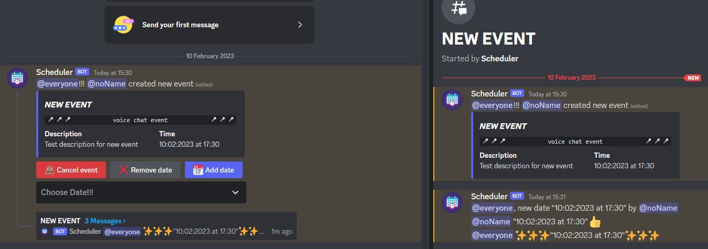

<h3 align="center">Discord Scheduler Bot</h3>

---

## About <a name = "about"></a>

Discrod bot for scheduling events in voice chat.

## Usage <a name = "usage"></a>

To use the bot, type:

```
/scedule "event_name"
```

## Installation <a name = "installation"></a>

Python: 3.10.7

py-cord: 2.3.2

python-dotenv: 0.21.1
<br><br>

Create ".env" file in your workspace

```
TOKEN="DISCORD-BOT-TOKEN"
```

### Example:


